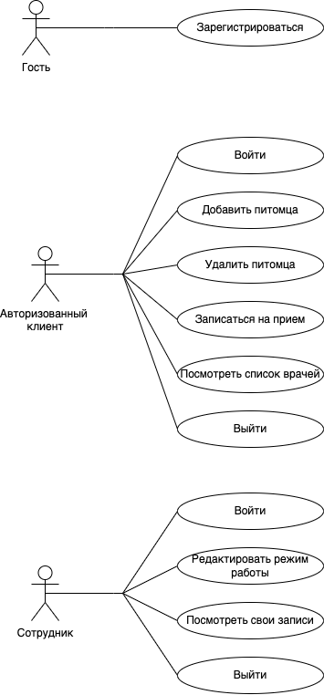
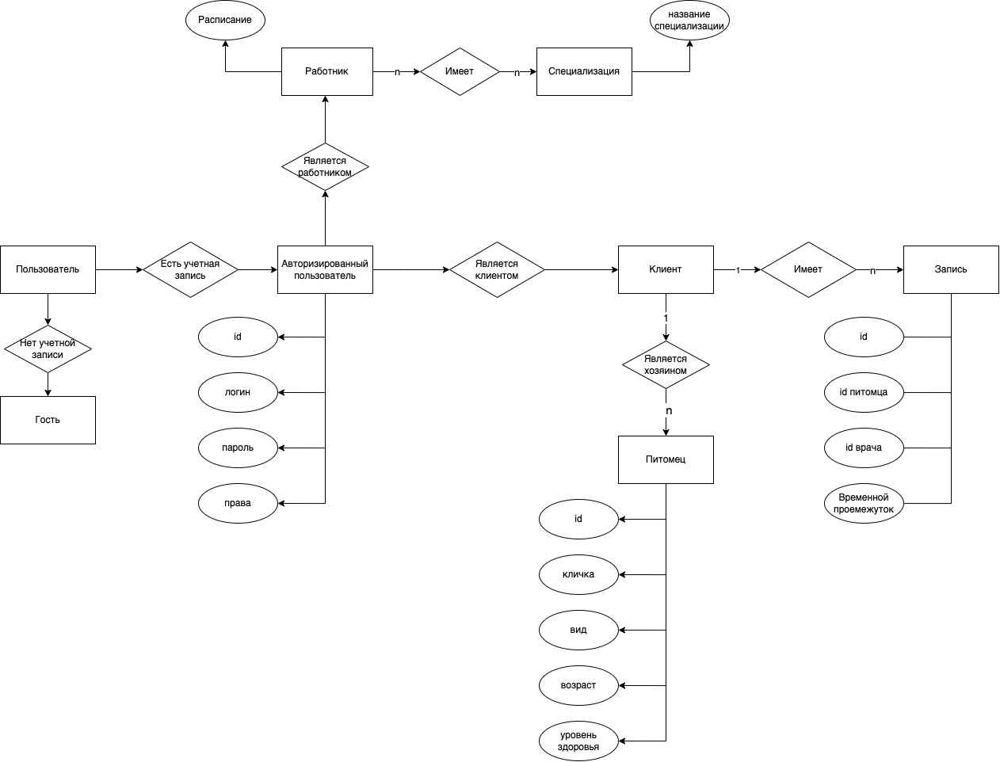
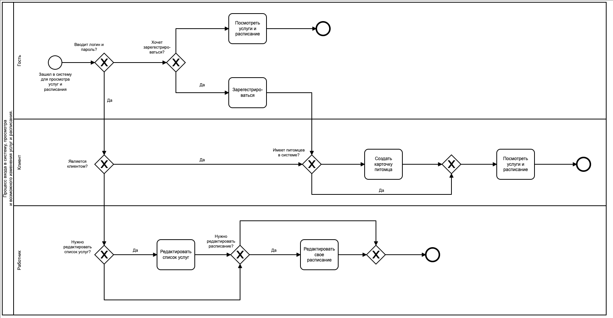
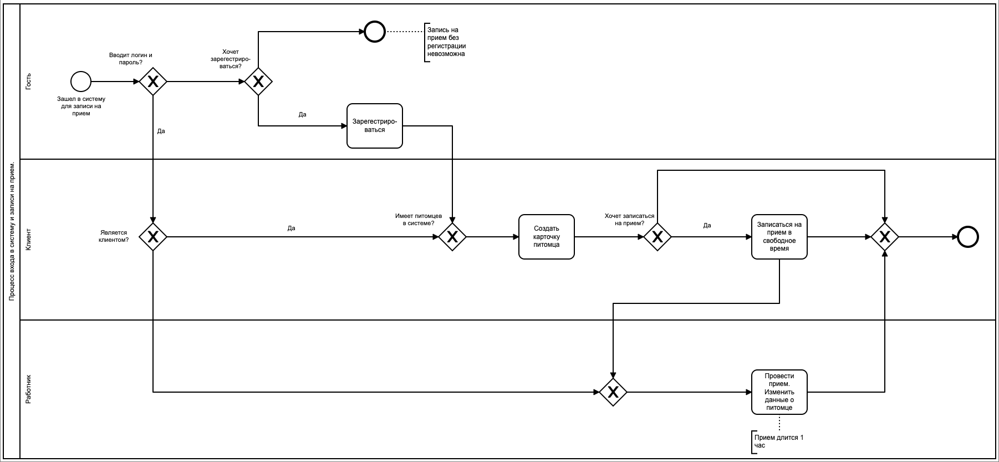
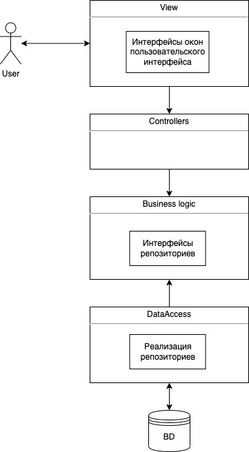
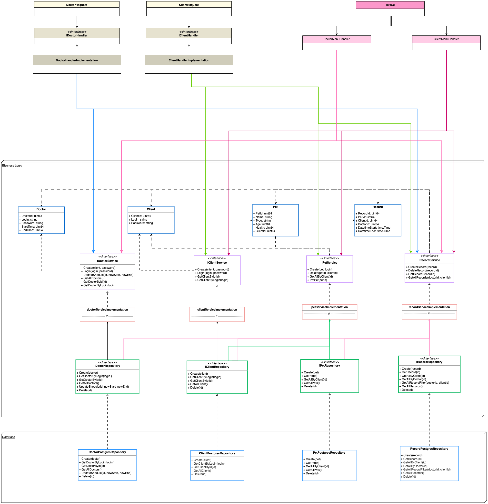

# Проект "У меня лапки".

## 1. Название проекта.

Ветеринарная клиника "У меня лапки". 

## 2. Краткое описание идеи проекта.

Приложение/сайт(нужное я подчеркну позже), имитирующее/ий работу ветеринарной клиники. Приложение/сайт должно/ен предоставлять функционал для работников, клиентов и гостей клиники. А также просмотр и редактирование данных о питомцах, прайс-лист и список услуг, расписание и запись на прием.

## 3. Краткое описание предметной области.

Животные, как и люди, всегда будут болеть. Мы часто можем вылечиться сами, выпив чай с ромашкой, но домашние питомцы так не могут. Также всегда найдутся хозяй(ки), которые захотят сводить своих питомцев на SPA-процедуры или заказать мастера по грумингу домой. Поэтому ветеринарные клиники будут популярны и востребованы всегда.

## 4. Краткий анализ аналогичных решений.

| Решение                | Личный кабинет питомца  | Онлайн-прием | Оффлайн-прием | Онлайн запись на прием (не звонок)| 
|------------------------|-----------|------------|---------|---------|
|[petstroy](https://petstory.ru)    | +     | +     |   -   | +     |
|[vet.city](https://vet.city)       | -     | -     |   +   | -     |
|[vetcare24](https://vetcare24.ru)  | -     | -     |   +   | -     |
| Предлагаемое решение | + | + | + | + |

Хочется отметить, что [petstroy](https://petstory.ru) - клиника без очных приемов,  а [vetcare24](https://vetcare24.ru) - только с услугами на дому.

## 5. Краткое обоснование целесообразности и актуальности проекта.

Рассмотренные в 4 пункте ветеринарные клиники содержат только контактную информацию и список услуг. Но в 2023 году, когда люди привыкли делать множество привычных вещей не выходя из дома и иметь доступ ко всей информации онлайн, нужны более юзерфрендли решения! Мой проект предоставляет возможность войти в личный кабинет, посмотреть бэкграунд своих питомцев и записаться на прием онлайн (именно записаться, а не позвонить по телефону, что для многих тоже стресс). Для многих питомцев выход из дома это стресс, а не все вопросы требуют очного присутствия врача, поэтому не менее важный функционал - онлайн-прием.

## 6. Use-Case - диаграмма. 

## 7. ER-диаграмма сущностей.

## 8. Пользовательские сценарии.
    
    1. Пользователь заходит в систему как гость, смотрит услуги предоставляемой клиники, врачей и их расписание.
    2. Пользователь заходит в систему как гость и регистриурется.
    3. Пользователь заходит в систему со своим логином и паролем. Смотрит услуги предоставляемой клиники, врачей, их расписание и свои записи на прием.
    4. Пользователь заходит в систему со своим логином и паролем. Добавляет нового питомца в систему (заполняет информацию о питомце). 
    5. Пользователь заходит в систему со своим логином и паролем. Выбирает нужного питомца и редактирует данные о нем.
    6. Пользователь заходит в систему со своим логином и паролем. Выбирает нужного питомца и записывается его на прием/удаляет запись на прием.
    7. Сотрудник заходит в систему со своим логином и паролем. Смотрит услуги предоставляемой клиники, врачей, их расписание и свое.
    8. Сотрудник заходит в систему со своим логином и паролем. Изменяет свое расписание (изменяет время или отменяет конкретные приемы).
    9. Сотрудник заходит в систему со своим логином и паролем. Изменяет информацию о любом питомце.
    10. Сотрудник заходит в систему со своим логином и паролем. Изменяет информацию о предоставляемых услугах.
    11. Сотрудник заходит в систему со своим логином и паролем. Смотрит статистику по питомцам (например, средний возраст питомцев или медиану по уровню здоровья)

## 9. Формализация бизнес-правил в виде BPMN.

[stormbpmn.com](https://stormbpmn.com/) (или я) не умеет в большие буквы, так что пишу текстом.

Диаграмма процесса входа в систему и возможности регистрации, а также просмотр и возможность изменения услуг и расписания клиники.

Диаграмма процесса входа в систему и записи на прием.

------------------------------------------------------------------------------------------------------------------

## 10. Описание типа приложения и выбранного технологического стека.

Язык: Go

Интерфейс: консоль.

База данных: PostgreSQL

Тип приложения: API

## 11. Верхнеуровневое разбиение на компоненты (в следующих лабах сможете уточнить): на базовом уровне выделяем компонент доступа к данным, компонент бизнес-логики и компонент реализации UI. Отобразить диаграммой компонентов. Подумать про принцип инверсии зависимостей.

## 12. UML диаграммы классов для двух отдельных компонентов - компонента доступа к данным и компонента с бизнес-логикой ( не забыть «модельные» классов сущностей: сущности базы данных, сущности системы и транспортные сущности. Если уровень транспортных сущностей пока сложно спроектировать, можно скопировать системные. Уточните их на следующих этапах)

------------------------------------------------------------------------------------------------------------------

## Уточненная UML диаграмма классов 

## Уточненное верхнеуровневое  разбиение на компоненты 

